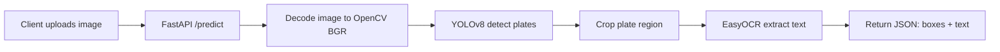

# Detailed Documentation: FastAPI + EasyOCR + Docker Deployment

This file explains (in detail) how your **License Plate Detection & Recognition** project works internally and how to deploy it using **FastAPI** and **Docker**.

It’s written for a fresher: it focuses on **what each component does**, **how they connect**, and **how to run/debug/deploy** the system.

---

## Goals of this deployment

Your original app is a **Streamlit UI** (good for demos). For real deployments/integration, most companies prefer:

- **FastAPI**: expose your ML pipeline as a **REST API** (any app can call it).
- **Docker**: package everything so it runs the same on any machine/server.

This enables:

- Plug-and-play integration with web apps, mobile apps, IoT cameras, etc.
- Easy deployment on VM / cloud / Kubernetes / on-prem servers.
- Consistent environment (Python libs + ML models) across machines.

---

## What “Tesseract” does in this project (OCR)

You detect license plates using YOLO, but YOLO only gives **where** the plate is (bounding box).  
To read the plate number (text), you need OCR (Optical Character Recognition).

- **EasyOCR** is a deep learning-based OCR library that works out-of-the-box.
- No system binaries needed - just `pip install easyocr`.
- Better accuracy for license plates compared to traditional OCR engines.

### Why EasyOCR is better than Tesseract for this project

- **No system dependencies**: EasyOCR installs purely via pip (no Windows/Linux binary installation needed).
- **Better accuracy**: Research shows EasyOCR performs better on real-world license plate images (rotated, low-contrast, distorted).
- **Handles preprocessing**: EasyOCR handles image preprocessing internally, reducing code complexity.
- **No compatibility issues**: Avoids numpy/pandas binary compatibility problems that pytesseract had.

---

## What FastAPI does in this project (serving the ML pipeline)

FastAPI turns your Python inference code into **HTTP endpoints**.

Think of it like this:

- Client (browser/app) sends an image → **HTTP request**
- FastAPI receives it → converts it into an OpenCV image
- YOLO detects plates → OCR reads text → output returned as JSON/image

### Why FastAPI is better than Streamlit for “real” usage

- **Separation of concerns**: UI is separate from inference backend.
- **Standard integration**: any language can call HTTP.
- **Scalability**: easier to run behind a reverse proxy, load balancer, autoscaling, etc.
- **Docs automatically**: Swagger UI at `/docs`.

---

## Current backend architecture (files you now have)

### `app/main.py` (API layer)

Responsibilities:

- Defines endpoints:
  - `GET /health`
  - `POST /predict` (JSON response)
  - `POST /predict/annotated` (image response)
- Validates file type, decodes image, calls inference functions.
- Starts server with Uvicorn (in Docker `CMD`).

### `app/inference.py` (ML pipeline layer)

Responsibilities:

- Loads YOLO model once (cached).
- Runs inference on image.
- For each detected plate:
  - crops region
  - runs EasyOCR to extract text
  - returns structured detection list
- Optionally draws bounding boxes + text on image (for annotated output).

This separation makes it easy to:

- add new endpoints without touching the pipeline
- swap models/weights
- test inference functions separately from API

---

## End-to-end pipeline (what happens on each request)

### Step-by-step flow

1. **Client uploads an image** to `POST /predict` as `multipart/form-data`.
2. `app/main.py` reads file bytes and validates content-type.
3. Bytes → PIL image (RGB) → NumPy array → OpenCV BGR image.
4. `predict_image()` runs YOLOv8:
   - model returns bounding boxes + confidence scores
5. For each bounding box:
   - crop license plate region
   - OCR with EasyOCR (handles preprocessing internally)
6. API returns:
   - count, detections (bbox, confidence, text), and extracted texts

### Flow diagram



---

## API endpoints (how to use)

Base URL (local): `http://localhost:8000`

### 1) Health check

**Request**

`GET /health`

**Response**

```json
{"status":"ok"}
```

### 2) Predict (JSON)

**Request**

`POST /predict?conf=0.25` with form field:

- `file`: image file (jpg/png/jpeg)

**PowerShell example**

```powershell
curl.exe -X POST "http://localhost:8000/predict?conf=0.25" -F "file=@your_image.jpg"
```

**Response format**

```json
{
  "count": 1,
  "detections": [
    {
      "bbox_xyxy": [x1, y1, x2, y2],
      "confidence": 0.87,
      "text": "DL8CAF5030"
    }
  ],
  "texts": ["DL8CAF5030"]
}
```

### 3) Predict annotated image (JPG output)

This returns an **image** you can save as `out.jpg`.

**PowerShell example**

```powershell
curl.exe -X POST "http://localhost:8000/predict/annotated?conf=0.25" -F "file=@your_image.jpg" --output out.jpg
```

---

## Model loading (how weights are managed)

The model loads from this environment variable:

- `MODEL_PATH` (default: `kbest.pt`)

In code, `get_model()` is cached:

- first request (or server startup) loads the model
- subsequent requests reuse the same loaded model

This is important because loading YOLO weights is expensive.

---

## Configuration via environment variables

These environment variables are supported:

- **`MODEL_PATH`**: path to YOLO weights file
  - default: `kbest.pt`
- **`YOLO_DEVICE`**: inference device
  - default: `cpu`
  - example: `cuda:0` (GPU, if you build a GPU container)
- **`YOLO_CONF`**: default confidence threshold
  - default: `0.25`

Where they are applied:

- `/predict?conf=` overrides the threshold for a single request
- Otherwise `YOLO_CONF` is used as a default

---

## How Docker containerization works here

### Concept: image vs container

- **Image**: a build artifact (template) containing code + dependencies.
- **Container**: a running instance of that image.

Your Docker image includes:

- Linux base OS (Debian slim)
- Python dependencies installed (`pip install ...`) including EasyOCR
- Your FastAPI code
- Your weights file `kbest.pt` copied into `/app/kbest.pt`

### Why Docker is useful for ML projects

ML projects usually depend on:

- Python libs (ultralytics, torch, opencv, easyocr)
- ML models (EasyOCR downloads models on first run, ~500MB)

Docker captures everything in one reproducible package. EasyOCR models are downloaded automatically on first use.

---

## Running without Docker (local development)

From repo root:

```bash
pip install -r requirements.txt
uvicorn app.main:app --reload --port 8000
```

Open:

- Swagger: `http://localhost:8000/docs`
- Health: `http://localhost:8000/health`

When you change code, `--reload` restarts server automatically.

---

## Running with Docker (deployment style)

### 1) Ensure Docker Engine is running

On Windows this typically means **Docker Desktop is started**.

Verify:

```powershell
docker version
```

You should see both **Client** and **Server** sections.

### 2) Build image

```bash
docker build -t plate-api .
```

### 3) Run container

```bash
docker run --rm -p 8000:8000 plate-api
```

Now visit `http://localhost:8000/docs`.

---

## Running with Docker Compose (easier run)

Compose is basically “run this container with these settings”.

```bash
docker compose up --build
```

Stop:

```bash
docker compose down
```

---

## Using your own weights (recommended production pattern)

You may want weights outside the image (so you can update weights without rebuilding).

### Example (PowerShell)

Assume you have weights in a folder `models\kbest.pt`:

```powershell
docker run --rm -p 8000:8000 `
  -e MODEL_PATH=/models/kbest.pt `
  -v "${PWD}\models:/models" `
  plate-api
```

This mounts your local `models/` directory into the container at `/models`.

---

## What I changed/added (summary)

Added:

- `app/main.py`: FastAPI endpoints
- `app/inference.py`: model + OCR pipeline
- `requirements.txt`: real dependencies
- `Dockerfile`: container build
- `.dockerignore`: keeps image small (excludes `.venv`, demos, etc.)
- `docker-compose.yml`: one-command run

Updated:

- `README.md`: added FastAPI + Docker usage instructions

---

## Common issues & troubleshooting

### 1) Docker build fails: “dockerDesktopLinuxEngine pipe not found”

This means **Docker Desktop (engine) is not running** or context is wrong.

- Start Docker Desktop
- Re-run `docker version`

### 2) `FileNotFoundError: Model weights not found`

The API starts with a warmup check. Fix:

- ensure `kbest.pt` exists in repo root, OR
- set `MODEL_PATH` to correct path, OR
- mount a volume and point `MODEL_PATH` to it

### 3) OCR returns empty/wrong text

OCR quality depends on:

- image quality (blur, angle, low light)
- crop quality (bbox too tight/loose)

EasyOCR handles preprocessing internally. If text is empty:

- First OCR call downloads models (~500MB) - wait 2-3 minutes
- Check `/health/ocr` endpoint to verify EasyOCR is working
- Try improving image quality or adjusting YOLO confidence threshold
- EasyOCR models are cached in `~/.EasyOCR/model/` after first download

### 4) Slow inference

CPU inference is slower. Options:

- resize input images before sending
- batch requests (advanced)
- move to GPU (requires GPU image + NVIDIA container runtime)

---

## Next improvements (production-ready)

If you want to make this “industry-grade”, the next steps typically are:

- Add `/predict/video` endpoint (async + streaming or job queue)
- Add request limits + auth token (basic security)
- Add logging + structured error responses
- Add unit tests for `predict_image()`
- Add model versioning (store `MODEL_PATH` and metadata)
- Add GPU Dockerfile variant

